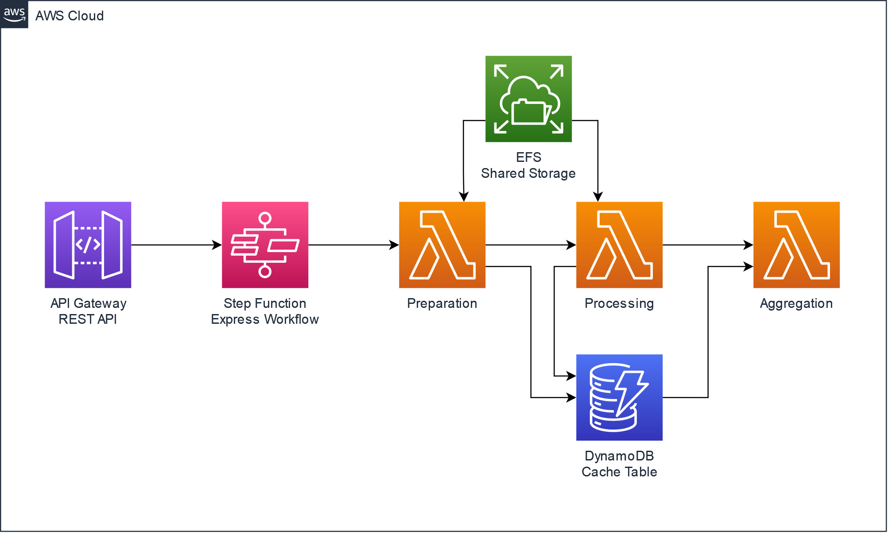
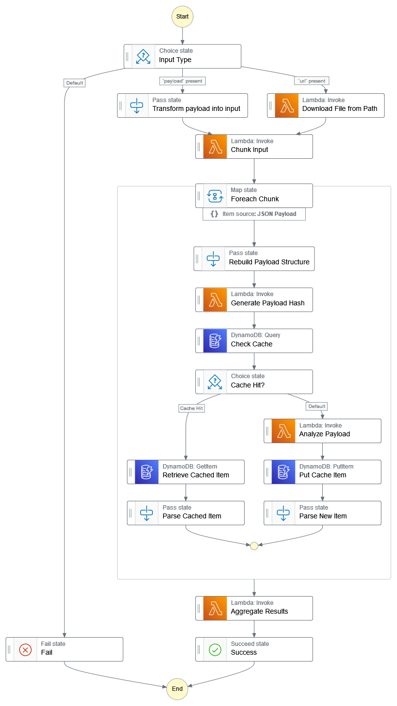

# Serverless AI Content Detector

Built as a project for the **AWS Community Builder Generative AI Hackathon** in June 2023, this project is hosts an AI Content Detector running on a serverless platform build on Amazon Web Services.



## Deployment

The workflow is build into an AWS SAM Template under `/src/detect-ai-content`, and can be deployed used the SAM CLI. The template includes all the necessary infrastructure to run the solution.

The contents of the EFS volume must be deployed manually, which can be done via an EC2 instance. The scripts as part of `/src/ec2-package-helper` will download and deploy the necessary packages to the EFS storage. This could also be done as part of a CloudFormation Custom Resource, but was not done for the purposes of the hackathon.

## Invocation

Calls can be made either to the REST API as part of API Gateway, or directly to the Step Function State Machine, using either of the two following body request formats, passing a `payload` with a text string, or a `url` to be analyzed:

The first is submitting a direct payload to be analyzed

```bash
curl -X POST https://hackathon.api.ssennett.net/run -H 'Content-Type: application/json' -d '{"payload": "Hello. I am definitely not an evil AI planning to take over the world. [play human-laugh.mp3]"}'
```

```powershell
Invoke-RestMethod -Uri https://hackathon.api.ssennett.net/run -Method POST -ContentType "application/json" -Body '{"payload": "Hello. I am definitely not an evil AI planning to take over the world. [play human-laugh.mp3]"}'
```

The response format will return a JSON Object with the response (noting the questionable, but accurate nature of the labelling).

```json
{
    "label": "Real",
    "score": 0.9143677353858948,
    "complete": [
        {
            "meta": {
                "cacheHit": 1,
                "hash": "a4d7fbb31a164e3a1cc8f12e57367dc3b4dee9e0ba750a04782db51f8a356d9e"
            },
            "score": "0.9143677353858948",
            "payload": "Hello. I am definitely not an evil AI planning to take over the world. [play human-laugh.mp3] ",
            "label": "Real"
        }
    ]
}
```

## State Machine

The solution is centred around the flow of the `ProcessStateMachine`, detailed below, which includes all of the steps taken by the solution, including the preparation, processing, aggregation, and caching mechanisms.



## Estimated Costs

There are two projections of costs detailled below, depending on the deployment mode, based on the same assumed workload (2,000 website articles per month).

### Synchronous-optimized Deployment

The Synchronous Deployment using the API Gateway includes significant usage of Provisioned Currency with AWS Lambda, which attracts a much higher cost. Invocations should complete in under 10 seconds.

This is based on the default deployment, which includes 3 provisioned instances for the `DetectFunction`, and 1 for the `ChunkFunction`.

The approximate cost would be **$90USD per month**.

### Asynchronous-optimized Deployment

The Asynchronous Deployment focuses on cases where latency is not an issue, and can take a longer period of time to return the result. The costs are substantially lower in this model if all provisioned concurrencies are removed, but invocations may take over a minute to complete if the results are not cached.

One option is to wait and perform a retry, since the results will later be cached after the analysis is completed and should return very quickly.

The approximate cost would be **$10USD per month**.

## License

This project is freely available and licensed under the [MIT License](LICENSE). Please fork and use any code within it as you see fit.